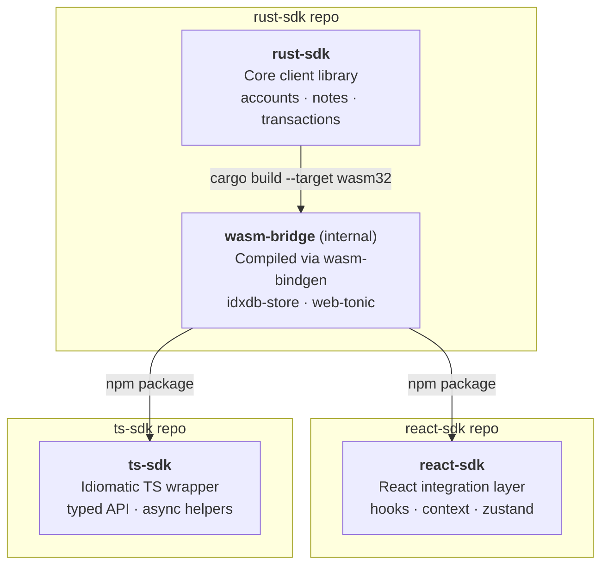

# Miden Rust SDK

[](https://github.com/0xMiden/miden-client/blob/main/LICENSE)
[](https://github.com/0xMiden/miden-client/actions/workflows/test.yml)
[](https://github.com/0xMiden/miden-client/actions/workflows/build.yml)
[](https://www.rust-lang.org/tools/install)
[](https://crates.io/crates/miden-client)

The Rust core of the [Miden](https://miden.io) client SDK. This repository contains the foundational Rust library that powers all Miden client interactions — account management, note handling, transaction building/proving, and state synchronization. It is part of a three-repo SDK architecture alongside [`ts-sdk`](https://github.com/0xMiden/ts-sdk) and [`react-sdk`](https://github.com/0xMiden/react-sdk).

### Status

The Miden client is under active development and should be considered *alpha*. APIs may change between releases. Many features are planned but not yet implemented.

## Architecture

The SDK is organized as a layered stack. Each layer builds on the one below it, providing progressively higher-level abstractions while maintaining full access to the underlying capabilities when needed.



### Layer Overview

| Layer | Published as | Language | Purpose |
|-------|-------------|----------|---------|
| **rust-sdk** | [`miden-client`](https://crates.io/crates/miden-client) (crates.io) | Rust | Core client library — account management, note handling, transaction building/execution/proving, state sync, node communication |
| **wasm-bridge** | `@miden-sdk/wasm-bridge` (npm, internal) | Rust → WASM | Compiles the Rust core to WebAssembly via `wasm-bindgen`. Serves as the compilation boundary between Rust and JavaScript |
| **ts-sdk** | [`@miden-sdk/ts-sdk`](https://www.npmjs.com/package/@miden-sdk/ts-sdk) (npm) | TypeScript | Idiomatic TypeScript wrapper over the WASM bridge. Primary entry point for **Node.js backends** and non-React frontends |
| **react-sdk** | [`@miden-sdk/react-sdk`](https://www.npmjs.com/package/@miden-sdk/react-sdk) (npm) | TypeScript | React integration layer — hooks, context providers, Zustand state management, auto-sync, and external signer support |

### Repository Split

The codebase will be split across three repositories, each owning one boundary of the stack:

| Repository | Contains | Rationale |
|------------|----------|-----------|
| **[`rust-sdk`](https://github.com/0xMiden/rust-sdk)** | Rust core library + WASM bridge + idxdb-store + sqlite-store + CLI | The foundational Rust crate and its WASM compilation boundary. Keeping the bridge in the same repo as the Rust core ensures API changes and their 90+ `wasm_bindgen` wrappers stay in sync. Publishes to crates.io and npm (internal WASM package). |
| **[`ts-sdk`](https://github.com/0xMiden/ts-sdk)** | TypeScript API surface + type definitions | Pure TypeScript wrapper over the WASM bridge. Consumes the npm package produced by `rust-sdk` and provides an idiomatic async/await API. Published to npm. |
| **[`react-sdk`](https://github.com/0xMiden/react-sdk)** | React hooks, providers, Zustand store, signer integrations | Framework-specific code that consumes the WASM bridge directly. Evolves independently with React ecosystem changes. |

## Motivation

### Why four layers?

The Miden protocol is implemented in Rust and relies heavily on zero-knowledge proof generation, which is computationally intensive and deeply tied to the Rust/WASM ecosystem. At the same time, the majority of end-user applications — wallets, dApps, block explorers — are built with web technologies. This creates a fundamental tension: the core logic *must* be Rust, but the developer experience *must* be TypeScript-native.

Rather than forcing one language to do everything, the SDK embraces the boundary between Rust and TypeScript as a first-class architectural concern and separates it into distinct layers, each with a clear responsibility.

### `rust-sdk` — The Foundational Core

**Crate:** [`miden-client`](https://crates.io/crates/miden-client)

The Rust SDK is the single source of truth for all Miden client logic. It is a `#![no_std]`-compatible library that implements:

- **Account management** — creating, importing, tracking, and updating accounts (wallets and faucets) with support for both public and private storage modes.
- **Note handling** — note screening, filtering, consumption, and export/import. Notes are Miden's UTXO-like primitive for transferring assets and encoding arbitrary logic.
- **Transaction building and execution** — constructing transactions from note consumption and script execution, running them through the Miden VM, and generating zero-knowledge proofs (locally or via a remote prover).
- **State synchronization** — maintaining a local partial view of the blockchain by syncing with a Miden node. The sync mechanism fetches new block headers, note inclusion proofs, nullifier updates, and account state changes, then applies them atomically to the local store.
- **Node communication** — a `NodeRpcClient` trait with a gRPC implementation that handles all RPC interactions including state sync, transaction submission, and data retrieval.
- **Key management** — a `Keystore` trait for managing signing keys, with a filesystem implementation for native and a Dexie-backed implementation for browsers.
- **Private note transport** — an optional transport network for delivering encrypted notes directly between parties without broadcasting them on-chain.

The `Client` struct is generic over an authenticator type (`Client<AUTH>`) and uses trait-based dependency injection for storage (`Store`), RPC (`NodeRpcClient`), proving (`TransactionProver`), and key management (`Keystore`), making every component swappable.

### `wasm-bridge` — The Compilation Boundary

The WASM bridge compiles the Rust core into WebAssembly and exposes it to JavaScript via `wasm-bindgen`. It lives in this repository (`rust-sdk`) alongside the Rust core it wraps, and is published as an **internal npm package** consumed by the TypeScript and React SDKs. Keeping the bridge co-located with the Rust code ensures that API changes and their 90+ `wasm_bindgen` wrappers can evolve in a single PR.

This layer handles type marshalling (90+ `#[wasm_bindgen]` wrapper types), Web Worker offloading for CPU-intensive operations (ZK proof generation, account creation), IndexedDB storage via `idxdb-store`, and sync locking to prevent state corruption in the browser environment.

### `ts-sdk` — The TypeScript Developer Experience

**Package:** [`@miden-sdk/ts-sdk`](https://www.npmjs.com/package/@miden-sdk/ts-sdk)

The TypeScript SDK is the **primary way to interact with the Miden network from JavaScript/TypeScript**. Its most important use case is **Node.js backend development** — building server-side services, indexers, bots, relayers, market makers, and any backend infrastructure that needs to read Miden state, submit transactions, or manage accounts programmatically. Think of it as the TypeScript equivalent of using the Rust SDK directly: full access to every client capability, but from Node.js with idiomatic async/await patterns and full type safety.

Beyond Node.js backends, the TypeScript SDK also serves **non-React frontend environments** — Vue, Svelte, Angular, Solid, vanilla JavaScript, or any web framework that isn't React. If you're building a Miden-integrated application and don't want (or need) React, this is your entry point.

See the [`ts-sdk` repository](https://github.com/0xMiden/ts-sdk) for the full API reference and usage examples.

### `react-sdk` — The React Integration Layer

**Package:** [`@miden-sdk/react-sdk`](https://www.npmjs.com/package/@miden-sdk/react-sdk)

The React SDK provides hooks, context providers, and Zustand-based state management for React applications, following conventions established by libraries like TanStack Query and wagmi. Includes hooks for account management (`useAccounts`, `useCreateWallet`), transactions (`useSend`, `useMint`, `useSwap`), note handling (`useNotes`, `useConsume`), and external signer integration (Para, Turnkey, MidenFi).

See the [`react-sdk` repository](https://github.com/0xMiden/react-sdk) for the full hooks reference, usage patterns, and signer integration guide.

## Supporting Components

### Storage Backends

The `Store` trait abstracts all persistence operations. Implementations must apply updates atomically — if any part of a state sync or transaction application fails, the entire operation rolls back.

| Crate | Target | Repository | Description |
|-------|--------|------------|-------------|
| `sqlite-store` | Native | `rust-sdk` | SQLite-based persistence using `rusqlite` with connection pooling. Used by the CLI and Rust backends. |
| `idxdb-store` | Browser | `rust-sdk` | IndexedDB-based persistence using Dexie.js. Supports multiple isolated databases per network. Lives alongside the WASM bridge it serves. |

### CLI

**Crate:** `miden-client-cli` — a command-line interface wrapping the Rust SDK with SQLite storage. See the [CLI README](./bin/miden-cli/README.md) for the full command reference and configuration.

### Testing Infrastructure

[`crates/testing`](./crates/testing) — shared test utilities, a test node builder for integration tests, and a remote prover server for testing delegated proving workflows.

## Key Architectural Patterns

### Trait-Based Dependency Injection

The Rust core uses trait objects to decouple components. The `Client` struct accepts any implementation of `Store`, `NodeRpcClient`, `TransactionProver`, `Keystore`, and `NoteTransportClient` via a builder pattern:

```rust
let client = ClientBuilder::for_testnet()
    .store(my_store)
    .authenticator(my_keystore)
    .prover(RemoteTransactionProver::new(endpoint))
    .build()
    .await?;
```

This makes it possible to swap SQLite for IndexedDB, local proving for remote proving, or filesystem keys for hardware wallet signing — all without changing any client logic.

### Atomic State Sync

State synchronization atomically applies a bundle of changes — new block headers, updated account states, committed/consumed notes, nullifier updates, MMR authentication nodes — to the local store. The `apply_state_sync()` method on the `Store` trait accepts a single `StateSyncUpdate` struct, and implementations must apply it transactionally.

### Web Worker Offloading

ZK proof generation and account creation are CPU-intensive operations that can take several seconds. The WASM bridge automatically offloads these to a dedicated Web Worker, preventing the main thread from freezing.

### no_std Core with Platform-Specific Backends

The Rust SDK is `#![no_std]` compatible. Platform-specific functionality is provided through feature flags:

- **Native:** `std` feature enables `tonic` gRPC with TLS, filesystem keystore, and concurrent execution.
- **WASM:** `wasm32` target enables `tonic-web-wasm-client` for gRPC-Web and `web-sys` for browser APIs.

## Repository Structure

This repository (`rust-sdk`) contains the Rust core, WASM bridge, storage backends, and CLI:

```
bin/
├── miden-cli/                # CLI binary
├── integration-tests/        # End-to-end integration tests
└── miden-bench/              # Benchmarks

crates/
├── rust-client/              # Core client library (miden-client)
├── web-client/               # WASM bridge (wasm-bindgen wrappers)
├── sqlite-store/             # SQLite storage backend (native)
├── idxdb-store/              # IndexedDB storage backend (browser)
└── testing/                  # Test infrastructure
    ├── miden-client-tests/   # Shared test utilities
    ├── node-builder/         # Test node builder
    └── prover/               # Remote prover for testing
```

See also: [`ts-sdk`](https://github.com/0xMiden/ts-sdk) (TypeScript API) · [`react-sdk`](https://github.com/0xMiden/react-sdk) (React hooks and providers)

## Getting Started

### For Rust developers

```toml
[dependencies]
miden-client = { version = "0.14", features = ["std", "tonic"] }
```

See the [Rust SDK README](./crates/rust-client/README.md) for details on feature flags and store implementations.

### For TypeScript / Node.js developers

```bash
npm install @miden-sdk/ts-sdk
```

```typescript
import { MidenClient } from "@miden-sdk/ts-sdk";

const client = await MidenClient.create({ rpcUrl: "https://rpc.testnet.miden.io" });
const wallet = await client.accounts.create();
await client.sync();
```

The TypeScript SDK is the primary choice for Node.js backends — indexers, bots, relayers, distribution services — and non-React browser environments. See the [`ts-sdk` repository](https://github.com/0xMiden/ts-sdk) for full API documentation.

### For React developers

```bash
npm install @miden-sdk/react-sdk @miden-sdk/ts-sdk
```

```tsx
import { MidenProvider, useAccounts, useCreateWallet } from "@miden-sdk/react-sdk";

function App() {
  return (
    <MidenProvider config={{ rpcUrl: "testnet" }}>
      <Wallet />
    </MidenProvider>
  );
}
```

See the [`react-sdk` repository](https://github.com/0xMiden/react-sdk) for hooks reference, signer integration, and usage patterns.

### CLI

```bash
cargo install miden-client-cli --locked
```

See the [CLI README](./bin/miden-cli/README.md) for the full command reference and configuration.

## Development

### Prerequisites

- Rust toolchain (see `rust-toolchain.toml`)
- Node.js >= 18 + Yarn
- `make` for build orchestration

### Common Commands

```bash
make install-tools          # Install dev tools (nextest, taplo, typos, etc.)
make build                  # Build all Rust crates
make build-wasm             # Build WASM targets
make lint                   # Run all lints (format, clippy, typos, eslint)
make format                 # Format all code (Rust, TS, TOML)
make test                   # Run unit tests
make integration-test       # Run integration tests (requires test node)
```

## Resources

- [Getting Started](https://0xMiden.github.io/miden-docs/miden-client/get-started/prerequisites.html)
- [CLI Reference](https://0xMiden.github.io/miden-docs/miden-client/cli-reference.html)
- [Configuration](https://0xMiden.github.io/miden-docs/miden-client/cli-config.html)
- [Online Documentation](https://0xMiden.github.io/miden-docs/miden-client/index.html)

## Contributing

Interested in contributing? Check [CONTRIBUTING.md](./CONTRIBUTING.md).

## License

This project is [MIT licensed](./LICENSE).
