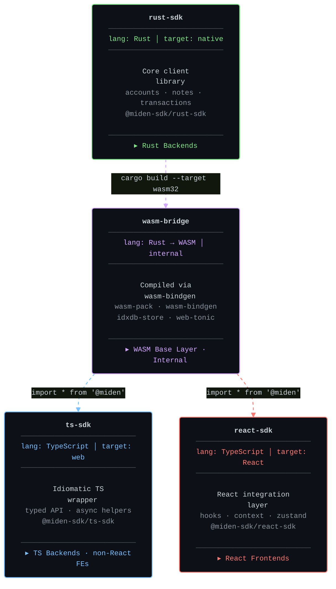

# Miden Client

[](https://github.com/0xMiden/miden-client/blob/main/LICENSE)
[](https://github.com/0xMiden/miden-client/actions/workflows/test.yml)
[](https://github.com/0xMiden/miden-client/actions/workflows/build.yml)
[](https://www.rust-lang.org/tools/install)
[](https://crates.io/crates/miden-client)

The official client SDK for the [Miden](https://miden.io) rollup. This monorepo provides everything needed to interact with the Miden network — from the low-level Rust core to high-level React hooks — across native and browser environments.

### Status

The Miden client is under active development and should be considered *alpha*. APIs may change between releases. Many features are planned but not yet implemented.

## Architecture

The SDK is organized as a layered stack. Each layer builds on the one below it, providing progressively higher-level abstractions while maintaining full access to the underlying capabilities when needed.



### Layer Overview

| Layer | Package | Language | Purpose |
|-------|---------|----------|---------|
| **rust-sdk** | `@miden-sdk/rust-sdk` | Rust | Core client library — account management, note handling, transaction building/execution/proving, state sync, node communication |
| **wasm-bridge** | *(internal)* | Rust → WASM | Compiles the Rust core to WebAssembly via `wasm-bindgen`. Not published as a standalone package — serves as the compilation boundary between Rust and JavaScript |
| **ts-sdk** | `@miden-sdk/ts-sdk` | TypeScript | Idiomatic TypeScript wrapper over the WASM bridge. Primary entry point for **Node.js backends** (indexers, bots, relayers, server-side services) and non-React frontends (Vue, Svelte, Angular, vanilla JS). Resource-based API, async helpers, and full type definitions |
| **react-sdk** | `@miden-sdk/react-sdk` | TypeScript | React integration layer — hooks, context providers, Zustand state management, auto-sync, and external signer support |

## Motivation

### Why four layers?

The Miden protocol is implemented in Rust and relies heavily on zero-knowledge proof generation, which is computationally intensive and deeply tied to the Rust/WASM ecosystem. At the same time, the majority of end-user applications — wallets, dApps, block explorers — are built with web technologies. This creates a fundamental tension: the core logic *must* be Rust, but the developer experience *must* be TypeScript-native.

Rather than forcing one language to do everything, the SDK embraces the boundary between Rust and TypeScript as a first-class architectural concern and separates it into distinct layers, each with a clear responsibility.

### `rust-sdk` — The Foundational Core

**Package:** `@miden-sdk/rust-sdk` · **Crate:** `miden-client`

The Rust SDK is the single source of truth for all Miden client logic. It is a `#![no_std]`-compatible library that implements:

- **Account management** — creating, importing, tracking, and updating accounts (wallets and faucets) with support for both public and private storage modes.
- **Note handling** — note screening, filtering, consumption, and export/import. Notes are Miden's UTXO-like primitive for transferring assets and encoding arbitrary logic.
- **Transaction building and execution** — constructing transactions from note consumption and script execution, running them through the Miden VM, and generating zero-knowledge proofs (locally or via a remote prover).
- **State synchronization** — maintaining a local partial view of the blockchain by syncing with a Miden node. The sync mechanism fetches new block headers, note inclusion proofs, nullifier updates, and account state changes, then applies them atomically to the local store.
- **Node communication** — a `NodeRpcClient` trait with a gRPC implementation that handles all RPC interactions including state sync, transaction submission, and data retrieval. On native targets, this uses `tonic` with TLS; on WASM, it uses `tonic-web-wasm-client`.
- **Key management** — a `Keystore` trait for managing signing keys, with a filesystem implementation for native and a Dexie-backed implementation for browsers.
- **Private note transport** — an optional transport network for delivering encrypted notes directly between parties without broadcasting them on-chain.

The Rust SDK is designed to be used directly by Rust backends, CLIs, and any native application. The `Client` struct is generic over an authenticator type (`Client<AUTH>`) and uses trait-based dependency injection for storage (`Store`), RPC (`NodeRpcClient`), proving (`TransactionProver`), and key management (`Keystore`), making every component swappable.

**Why a separate package?** The Rust SDK is a crates.io-published library with its own versioning, feature flags, and dependency tree. It must remain independent of any JavaScript tooling so that pure-Rust consumers (backends, infrastructure, other Rust clients) can depend on it without pulling in web-related dependencies. The `no_std` compatibility ensures it can target embedded or constrained environments.

### `wasm-bridge` — The Compilation Boundary

The WASM bridge is the layer that compiles the Rust core into WebAssembly and exposes it to JavaScript via `wasm-bindgen`. It is **not published as a standalone package** — it exists purely as an internal build artifact that both the TypeScript SDK and React SDK consume.

This layer handles several concerns that are specific to the Rust-to-WASM boundary:

- **Type marshalling** — Rust types are wrapped in `#[wasm_bindgen]` annotated structs that serialize/deserialize across the WASM boundary. Over 90 model wrapper types handle the translation between Rust's type system and JavaScript-compatible representations.
- **Web Worker offloading** — computationally expensive operations (account creation, transaction execution, ZK proof generation) are automatically routed to a dedicated Web Worker so they don't block the main thread.
- **IndexedDB storage** — the `idxdb-store` crate implements the `Store` trait using Dexie.js (an IndexedDB wrapper), with a TypeScript source layer compiled to JavaScript. The database schema includes separate "latest" and "historical" tables for account state, enabling efficient queries for current state while preserving full history.
- **Sync locking** — an exclusive lock mechanism ensures that concurrent sync operations don't corrupt local state in the single-threaded browser environment.

**Why is this internal?** The raw WASM bindings are not ergonomic for TypeScript developers. Method signatures use WASM-specific types, error handling follows Rust conventions, and the API surface mirrors the Rust struct layout rather than idiomatic JavaScript patterns. Exposing this layer directly would leak implementation details and create a brittle public API that breaks whenever the Rust internals change. By keeping it internal, the TypeScript and React SDKs can provide stable, idiomatic interfaces while the bridge evolves freely.

### `ts-sdk` — The TypeScript Developer Experience

**Package:** `@miden-sdk/ts-sdk`

The TypeScript SDK is the **primary way to interact with the Miden network from JavaScript/TypeScript**. Its most important use case is **Node.js backend development** — building server-side services, indexers, bots, relayers, market makers, and any backend infrastructure that needs to read Miden state, submit transactions, or manage accounts programmatically. Think of it as the TypeScript equivalent of using the Rust SDK directly: full access to every client capability, but from Node.js with idiomatic async/await patterns and full type safety.

Beyond Node.js backends, the TypeScript SDK also serves **non-React frontend environments** — Vue, Svelte, Angular, Solid, vanilla JavaScript, or any web framework that isn't React. If you're building a Miden-integrated application and don't want (or need) React, this is your entry point.

The SDK wraps the WASM bridge in a resource-based API that feels native to TypeScript developers. Instead of calling raw WASM methods, developers interact with high-level resource objects:

```typescript
import { MidenClient, AccountType } from "@miden-sdk/ts-sdk";

// Node.js backend — e.g., a token distribution service
const client = await MidenClient.create({ rpcUrl: "https://rpc.testnet.miden.io" });

const faucet = await client.accounts.create({
  type: AccountType.FungibleFaucet,
  symbol: "TOKEN",
  decimals: 8,
  maxSupply: 1_000_000_000n,
});

// Mint and distribute tokens on a schedule
for (const recipient of recipients) {
  await client.transactions.mint({ account: faucet, to: recipient, amount: 1000n });
}

const balance = await client.accounts.getBalance(faucet, faucet);
```

```typescript
// Non-React frontend — e.g., a Svelte or Vue wallet
import { MidenClient } from "@miden-sdk/ts-sdk";

const client = await MidenClient.create();
const wallet = await client.accounts.create();
await client.transactions.send({ account: wallet, to: recipient, token: faucet, amount: 100n });
await client.notes.consumeAll({ account: wallet });
```

Key features of the TypeScript SDK:

- **Node.js-first design** — the SDK is fully functional in Node.js environments, making it the go-to choice for building backend services that interact with Miden. Use it to build indexers that track on-chain state, bots that automate transaction flows, relayer services that submit transactions on behalf of users, or any server-side process that needs programmatic Miden access.
- **Resource-based API** — operations are grouped under `client.accounts`, `client.transactions`, `client.notes`, `client.tags`, and `client.settings`, matching mental models from REST APIs and modern SDK design. This is the same API surface whether you're running on a Node.js server or in a browser tab.
- **Factory methods** — `MidenClient.create()`, `MidenClient.createTestnet()`, and `MidenClient.createMock()` provide quick setup for different environments. A backend service connecting to a production node and a local development script use the same API, just different factory configurations.
- **Full TypeScript type definitions** — comprehensive `.d.ts` declarations generated from both `wasm-bindgen` output and hand-authored type files, ensuring full IDE support and compile-time safety. Every account, note, transaction, and asset type is fully typed.
- **Automatic resource management** — `client.terminate()` cleans up Web Workers (in browser contexts), with support for JavaScript's `using` syntax for automatic cleanup. In long-running Node.js processes, this ensures clean shutdown behavior.
- **Transparent worker delegation** — in browser contexts, the client uses a `Proxy` to intercept method calls and route heavy operations (ZK proof generation, account creation) to a Web Worker automatically, without the developer needing to manage workers manually.

**Why a separate package?** The TypeScript SDK exists because the JavaScript ecosystem extends far beyond React. Node.js is the most common runtime for backend services in the web3 space, and teams building on Miden need a first-class way to write backend infrastructure in TypeScript — not just frontends. A token distribution service, an automated market maker, a note relay, or a portfolio tracker all need the same core capabilities (accounts, transactions, sync) but have no use for React hooks or browser-specific APIs. The TypeScript SDK provides this framework-agnostic, runtime-agnostic foundation. It is also the building block for framework-specific integrations — the React SDK depends on it rather than reimplementing the WASM interaction, and future integrations for Vue, Svelte, or other frameworks would follow the same pattern.

### `react-sdk` — The React Integration Layer

**Package:** `@miden-sdk/react-sdk`

The React SDK provides a complete React integration with hooks, context providers, and state management, following conventions established by libraries like TanStack Query and wagmi:

```tsx
import { MidenProvider, useAccounts, useCreateWallet, useSend } from "@miden-sdk/react-sdk";

function App() {
  return (
    <MidenProvider config={{ rpcUrl: "testnet" }}>
      <Wallet />
    </MidenProvider>
  );
}

function Wallet() {
  const { wallets } = useAccounts();
  const { createWallet, isCreating } = useCreateWallet();
  const { send, stage } = useSend(); // stage: idle → executing → proving → submitting → complete

  return (
    <div>
      <p>{wallets.length} wallets</p>
      <button onClick={() => createWallet()}>New Wallet</button>
      <p>Transaction: {stage}</p>
    </div>
  );
}
```

Key features:

- **`MidenProvider`** — a single provider component that handles WASM initialization, client construction, auto-sync (configurable interval, default 15s), and lifecycle management. Supports both local keystore and external signer modes.
- **Query hooks** — `useAccounts()`, `useAccount(id)`, `useNotes()`, `useSyncState()`, `useAssetMetadata()`, `useTransactionHistory()`. Each returns domain-specific data alongside `isLoading` and `error` state.
- **Mutation hooks** — `useCreateWallet()`, `useCreateFaucet()`, `useSend()`, `useMultiSend()`, `useMint()`, `useConsume()`, `useSwap()`, `useTransaction()`. Each returns a named action function alongside `isLoading`, `stage`, `error`, and result state, with granular transaction stage tracking (`idle` → `executing` → `proving` → `submitting` → `complete`).
- **Zustand state management** — a centralized store manages client state, cached data, loading states, and sync status, with optimized selector hooks to minimize unnecessary re-renders.
- **External signer support** — a `SignerContext` enables integration with external key management services (Para, Turnkey, MidenFi wallet adapter) via a provider pattern, allowing wallets to use hardware keys, passkeys, or custodial signing services.
- **Exclusive execution** — `runExclusive()` provides a mutex for operations that must not interleave, preventing race conditions in the single-threaded WASM environment.

**Why a separate package?** React has its own paradigms — hooks, context, component lifecycle, state management — that don't belong in a general-purpose TypeScript SDK. By separating React-specific code, the core TypeScript SDK stays lean and framework-agnostic, while React developers get a first-class experience with hooks that handle loading states, error boundaries, caching, and re-render optimization automatically. This separation also allows the React SDK to evolve independently (e.g., adopting React Server Components or new React patterns) without affecting non-React consumers.

## Supporting Components

Beyond the four main SDK layers, the repository includes several supporting crates and packages:

### Storage Backends

| Crate | Target | Description |
|-------|--------|-------------|
| [`sqlite-store`](./crates/sqlite-store) | Native | SQLite-based persistence using `rusqlite` with connection pooling (`deadpool`). Maintains an in-memory Sparse Merkle Tree forest for efficient vault and storage proofs. Used by the CLI and Rust backends. |
| [`idxdb-store`](./crates/idxdb-store) | Browser | IndexedDB-based persistence using Dexie.js. TypeScript source in `src/ts/` compiled to JavaScript in `src/js/` (both committed, CI verifies consistency). Supports multiple isolated databases per network via a registry pattern. |

The `Store` trait abstracts all persistence operations (40+ async methods covering accounts, notes, transactions, chain data, sync state, and settings). Both backends implement atomic updates — if any part of a state sync or transaction application fails, the entire operation rolls back.

### CLI (`miden-client`)

**Crate:** `miden-client-cli`

The CLI is a full-featured command-line interface for interacting with the Miden network directly from a terminal. It wraps the Rust SDK (`Client<FilesystemKeyStore>`) with SQLite storage, providing a complete Miden experience without writing any code. It's the fastest way to explore the network, prototype transaction flows, and manage accounts during development.

The CLI auto-discovers configuration from `.miden/miden-client.toml` (local project directory first, then `~/.miden/` global). Running `miden-client init` generates this file with RPC endpoint and database path settings.

**Commands:**

| Command | Description |
|---------|-------------|
| `init` | Initialize client configuration for a network (localhost, devnet, testnet, or custom endpoint) |
| `sync` | Synchronize local state with the Miden node — fetches new blocks, note updates, and account changes |
| `new-wallet` | Create a new wallet account (private/public storage, mutable/immutable, Falcon/ECDSA auth) |
| `new-account` | Create a new account with advanced options |
| `account` | List and inspect accounts — view IDs, balances, storage, vault contents |
| `mint` | Mint tokens from a faucet account to a recipient |
| `send` | Send tokens from one account to another (public or private notes) |
| `swap` | Execute an atomic swap between two token types |
| `consume-notes` | Consume available notes for an account, claiming their assets |
| `notes` | List and inspect notes — filter by status (pending, committed, consumed) |
| `tx` | View transaction history and details |
| `exec` | Execute arbitrary Miden Assembly programs against an account |
| `tags` | Manage note tags for filtering which notes the client tracks |
| `address` | Display account addresses in hex and bech32 formats |
| `import` / `export` | Import and export accounts and notes for backup or transfer between clients |
| `info` | Display client state summary — sync height, account count, node connection status |

**Example workflow:**

```bash
# Initialize for testnet
miden-client init --network testnet

# Sync with the network
miden-client sync

# Create a wallet
miden-client new-wallet

# Create a faucet and mint tokens
miden-client new-account -t fungible-faucet -s TOKEN -d 8 -m 1000000
miden-client mint --faucet <faucet-id> --target <wallet-id> --amount 1000

# Consume minted notes and check balance
miden-client sync
miden-client consume-notes --account <wallet-id>
miden-client account -s <wallet-id>

# Send tokens
miden-client send --sender <wallet-id> --target <recipient-id> --faucet <faucet-id> --amount 100
```

The `CliClient` struct is also available as a Rust library for projects that want CLI-style configuration discovery without building a full custom client:

```rust
use miden_client_cli::{CliClient, DebugMode};

let mut client = CliClient::from_system_user_config(DebugMode::Disabled).await?;
client.sync_state().await?;
```

### Vite Plugin

[`packages/vite-plugin`](./packages/vite-plugin) — a Vite plugin for applications consuming the WASM SDK. Handles proper WASM bundling, Web Worker configuration, and shared memory setup (required for WASM atomics).

### Testing Infrastructure

[`crates/testing`](./crates/testing) — shared test utilities, a test node builder for integration tests, and a remote prover server for testing delegated proving workflows.

## Key Architectural Patterns

### Trait-Based Dependency Injection

The Rust core uses trait objects extensively to decouple components. The `Client` struct accepts any implementation of `Store`, `NodeRpcClient`, `TransactionProver`, `Keystore`, and `NoteTransportClient` via a builder pattern:

```rust
let client = ClientBuilder::for_testnet()
    .store(my_store)
    .authenticator(my_keystore)
    .prover(RemoteTransactionProver::new(endpoint))
    .build()
    .await?;
```

This makes it possible to swap SQLite for IndexedDB, local proving for remote proving, or filesystem keys for hardware wallet signing — all without changing any client logic.

### Atomic State Sync

State synchronization is the most complex operation in the client. It must atomically apply a bundle of changes — new block headers, updated account states, committed/consumed notes, nullifier updates, MMR authentication nodes — to the local store. The `apply_state_sync()` method on the `Store` trait accepts a single `StateSyncUpdate` struct containing all changes, and implementations must apply them transactionally (SQLite uses a database transaction; IndexedDB uses a Dexie transaction spanning multiple object stores).

### Web Worker Offloading

Zero-knowledge proof generation and account creation are CPU-intensive operations that can take several seconds. The WASM bridge automatically offloads these to a dedicated Web Worker, preventing the main thread from freezing. The JavaScript layer uses a `Proxy` to transparently intercept method calls and route them to the worker, so consumers don't need to manage worker communication manually.

### no_std Core with Platform-Specific Backends

The Rust SDK is `#![no_std]` compatible, using `alloc` for heap allocations. Platform-specific functionality is provided through feature flags and conditional compilation:

- **Native:** `std` feature enables `tonic` gRPC with TLS, filesystem keystore, and concurrent transaction execution.
- **WASM:** `wasm32` target enables `tonic-web-wasm-client` for gRPC-Web, `getrandom/wasm_js` for browser entropy, and `web-sys` for Web API access.

This design ensures the core logic compiles to any target Rust supports, while platform-specific integrations are cleanly separated.

### Database Isolation by Network

The IndexedDB store creates separate databases per network (`MidenClientDB_testnet`, `MidenClientDB_devnet`, etc.) via a JavaScript-side registry. This prevents testnet and devnet state from colliding in the same browser and allows external signer providers to create isolated databases per user (`mywallet_{address}`).

## Repository Structure

```
bin/
├── miden-cli/                # CLI binary (rust-sdk wrapper)
├── integration-tests/        # End-to-end integration tests
└── miden-bench/              # Benchmarks

crates/
├── rust-client/              # rust-sdk — core client library (miden-client)
├── idxdb-store/              # IndexedDB storage backend (browser)
├── sqlite-store/             # SQLite storage backend (native)
└── testing/                  # Test infrastructure
    ├── miden-client-tests/   # Shared test utilities
    ├── node-builder/         # Test node builder
    └── prover/               # Remote prover for testing
```

## Getting Started

### For Rust developers

Add the client as a dependency:

```toml
[dependencies]
miden-client = { version = "0.14", features = ["std", "tonic"] }
```

See the [Rust SDK README](./crates/rust-client/README.md) for details on feature flags and store implementations.

### For TypeScript / Node.js developers

```bash
npm install @miden-sdk/ts-sdk
```

```typescript
import { MidenClient } from "@miden-sdk/ts-sdk";

// Node.js backend service
const client = await MidenClient.create({ rpcUrl: "https://rpc.testnet.miden.io" });
const wallet = await client.accounts.create();
await client.sync();

// Also works in browser environments (Vue, Svelte, Angular, vanilla JS)
```

The TypeScript SDK is the primary choice for Node.js backends — indexers, bots, relayers, distribution services, and any server-side Miden integration. It also works in non-React browser environments. See the [TypeScript SDK README](./crates/web-client/README.md) for full API documentation and examples.

### For React developers

```bash
npm install @miden-sdk/react-sdk @miden-sdk/ts-sdk
```

```tsx
import { MidenProvider, useAccounts, useCreateWallet } from "@miden-sdk/react-sdk";

function App() {
  return (
    <MidenProvider config={{ rpcUrl: "testnet" }}>
      <Wallet />
    </MidenProvider>
  );
}
```

See the [React SDK README](./packages/react-sdk/README.md) for hooks reference, signer integration, and usage patterns.

### CLI

```bash
# Install from crates.io
cargo install miden-client-cli --locked

# Or build from source
make install

# Initialize and start using
miden-client init --network testnet
miden-client sync
miden-client new-wallet
```

The CLI is the quickest way to interact with Miden without writing code — create accounts, mint tokens, send transactions, and inspect state from your terminal. See the [CLI README](./bin/miden-cli/README.md) for the full command reference and configuration.

## Development

### Prerequisites

- Rust toolchain (see `rust-toolchain.toml`)
- Node.js >= 18 + Yarn
- `make` for build orchestration

### Common Commands

```bash
make install-tools          # Install dev tools (nextest, taplo, typos, etc.)
make build                  # Build all Rust crates
make build-wasm             # Build WASM targets
make build-react-sdk        # Build web-client + react-sdk
make lint                   # Run all lints (format, clippy, typos, eslint)
make format                 # Format all code (Rust, TS, TOML)
make test                   # Run unit tests
make test-docs              # Run documentation tests
make integration-test       # Run integration tests (requires test node)
make start-node-background  # Start local test node
make stop-node              # Stop local test node
```

### Testing

```bash
# Unit tests
make test

# Integration tests (requires running node)
make start-node-background
make integration-test
make stop-node

# Web client integration tests (Playwright)
make integration-test-web-client

# React SDK tests
cd packages/react-sdk && yarn test
```

## Resources

- [Getting Started](https://0xMiden.github.io/miden-docs/miden-client/get-started/prerequisites.html)
- [CLI Reference](https://0xMiden.github.io/miden-docs/miden-client/cli-reference.html)
- [Configuration](https://0xMiden.github.io/miden-docs/miden-client/cli-config.html)
- [Online Documentation](https://0xMiden.github.io/miden-docs/miden-client/index.html)

## Contributing

Interested in contributing? Check [CONTRIBUTING.md](./CONTRIBUTING.md).

## License

This project is [MIT licensed](./LICENSE).
