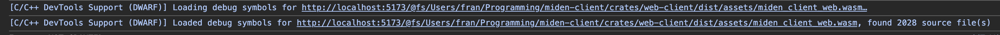
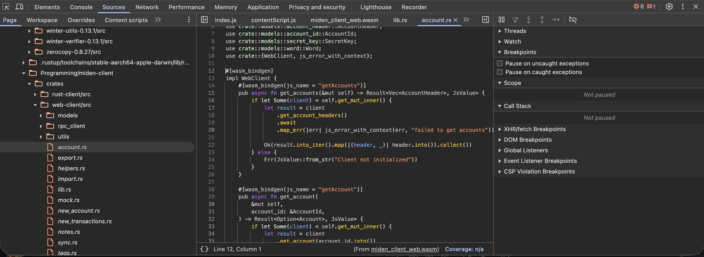
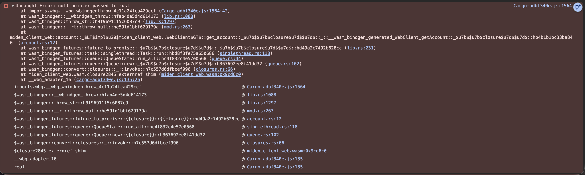

# Debugging WASM

When debugging WASM, it can be tricky to trace the origin of an error since stack traces are not often noisy and difficult to read.
To better trace these errors, a build with debug symbols can be generated. This doc explains how to set it up.

## Requirements
    - `yarn`
    - Compatible Rust version
    - Chrome browser
    - You will need to install this [extension](https://goo.gle/wasm-debugging-extension).
      Despite the name, it will also work with WASM-generated Rust Files
    
## Building with debug symbols

1. cd into to the root of the web-client project, that is: `miden-client/crates/web-client`.
2. build the dev profile with: 
   ```yarn build-dev```
3. Once it finishes, the Rust build log should print this:
  ```
    Finished `release` profile [optimized + debuginfo] target(s) in 38.33s
  ```
  4. (Optional) To double-check that debug symbols were generated, install the WebAssembly Binary Toolkit (WABT). Sources:
  - [brew package manager](https://formulae.brew.sh/formula/wabt)
  - [nix packages](https://github.com/NixOS/nixpkgs/blob/25e53aa156d47bad5082ff7618f5feb1f5e02d01/pkgs/by-name/wa/wabt/package.nix#L27)
  - [source](https://github.com/WebAssembly/wabt).
 The WABT package provides an `wasm-obj` binary, which you can use like so:
 ```
 wasm-objdump --headers dist/workers/assets/miden_client_web.wasm
 ```
 If the debug symbols are present, you should see a bunch of "debug" headers.
 An example of an output like this would be:
 ```
   Custom start=0x00a85ee7 end=0x00a85f63 (size=0x0000007c) "producers"
   Custom start=0x00a85f67 end=0x00bc6700 (size=0x00140799) ".debug_abbrev"
   Custom start=0x00bc6705 end=0x03f1989b (size=0x03353196) ".debug_str"
   Custom start=0x03f198a0 end=0x0480968b (size=0x008efdeb) ".debug_line"
   Custom start=0x04809690 end=0x04c347ae (size=0x0042b11e) ".debug_ranges"
   Custom start=0x04c347b3 end=0x059ae810 (size=0x00d7a05d) ".debug_loc"
   Custom start=0x059ae815 end=0x09113060 (size=0x0376484b) ".debug_info"
 ```
    
## Using the debug symbols

Once you have both the debug WASM and the Chrome extension, we need to link
the dependency to the JS app we're debugging .

1. Link the package, cd to: `miden-client/crates/web-client` and run:
```
yarn link 
```
2. In the root of the project you're debugging, run this:
```
yarn link "@demox-labs/miden-sdk"
```
3. When you open the devtools with chrome, you will see an output like this:
.

You should also be able to see the rust source in the devtools source tab:


Also, you should seed friendlier stack-traces:



## Relevant changes

These changes are already reflected in the codebase, but the settings to make the release build have debug symbols are the following:

1. In the `rollup.config.js` the relevant options for the Rust plugin are:
```
{
   extraArgs: {
       wasmBindgen: [ "--keep-debug"],
   } 
}
```
2. The rollup plugin also calls cargo internally, which needs these arguments to add debug symbols:
   
```javascript
const cargoArgsUseDebugSymbols = [
  // Generate debug symbols for the release cargo profile.
  "--config",
  "profile.release.debug='full'",
  // Do not remove debug symbols from the final binary,
  "--config",
  "profile.release.strip='none'",
];
```
