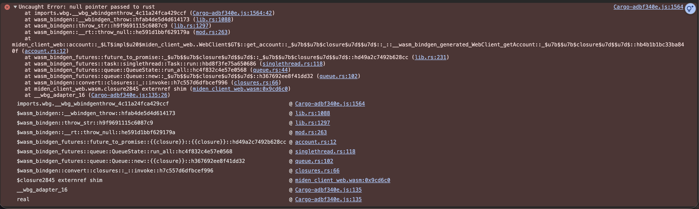

# Debugging WASM

When debugging WASM, it can be tricky to trace the origin of an error since stack traces are not often noisy and difficult to read.
To better trace these errors, a build with debug symbols can be generated. This doc explains how to set it up.

## Requirements
    - yarn
    - Compatible Rust version
    - Chrome browser
    - [wasm-debugging-extension](https://goo.gle/wasm-debugging-extension).
    
## Building with debug symbols

1. Clone the miden-client repo:
```bash
git clone git@github.com:0xMiden/miden-client.git
```
2. Build miden-client with debug-symbols:
```bash
make build-web-client-debug
```
Once it finishes, the Rust build log should print this:
```
    Finished `release` profile [optimized + debuginfo] target(s) in 38.33s
```
    
## Using the debug symbols

Once you have both the debug WASM and the Chrome extension, we need to link
the dependency to the JS app we're debugging.

1. Once you have the web client built with debug symbols, we have to use it as a dependency,
for that we'll use [yarn link](https://classic.yarnpkg.com/lang/en/docs/cli/link/), 
run this in your local copy of miden-client:
```
make link-web-client-dep
```
2. Then, run this command in the root of the project that needs to be debugged:
```
yarn link "@miden-sdk/miden-sdk"
```
Essentially,`yarn link` makes the project use the local modified version of the sdk instead of the NPM hosted one. Now, when you open the devtools with chrome, you will see an output like this:


.


You should also be able to see the rust source in the devtools source tab:


Also, you should see friendlier stack-traces:

