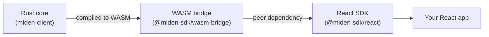
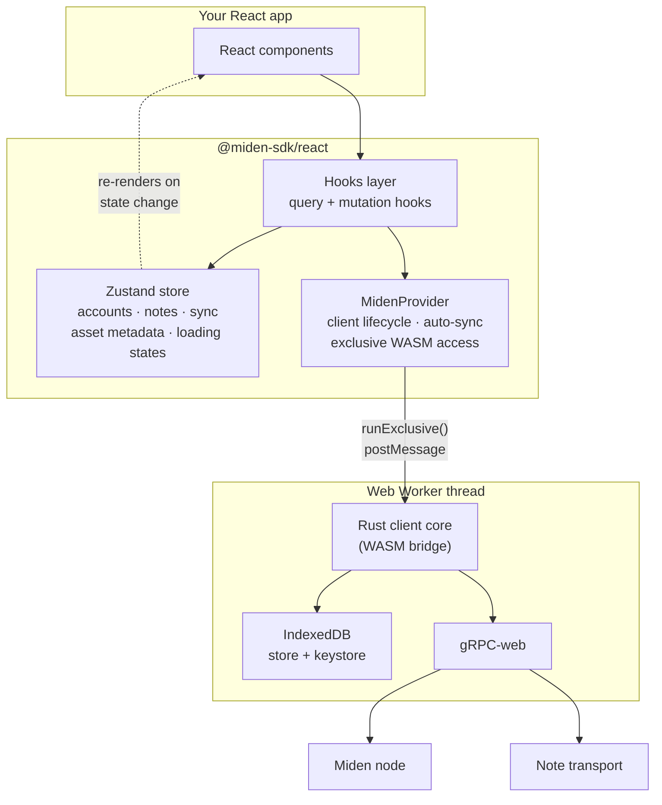
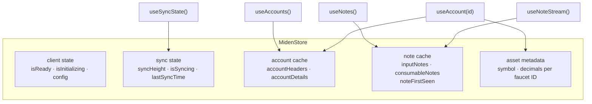
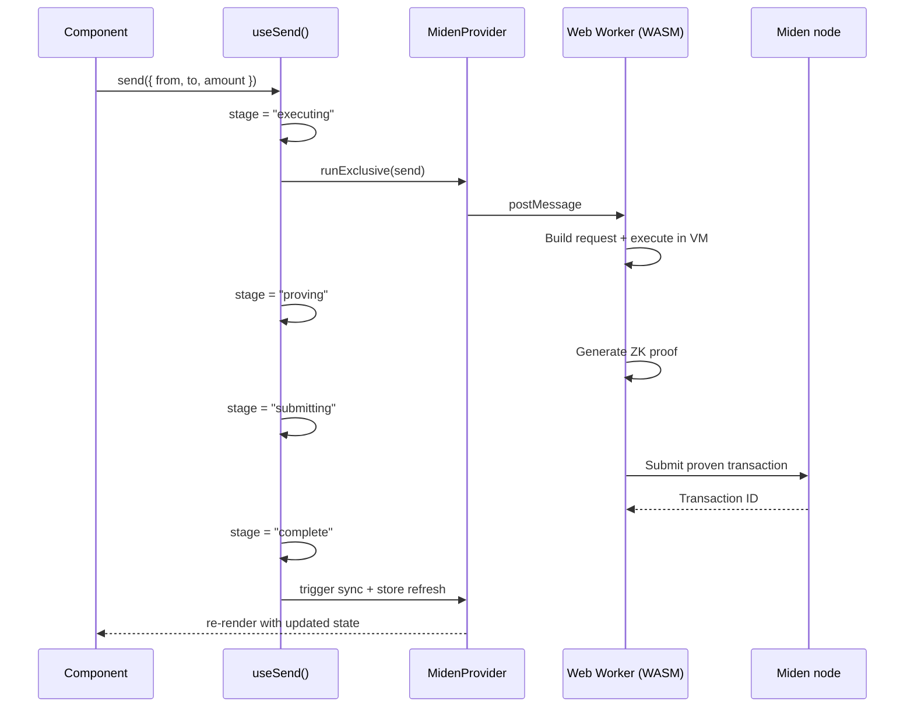
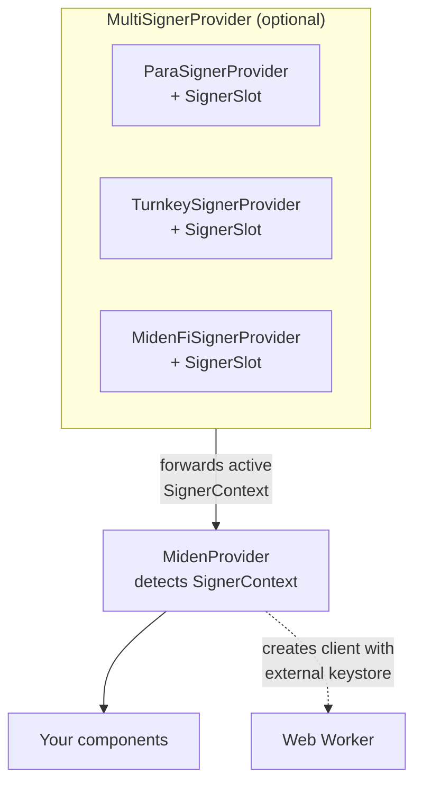

# Design

This page explains how the React SDK is structured and how its pieces fit together at runtime.

## How the SDK reaches the browser

The React SDK is a pure TypeScript/React package that wraps the [WASM bridge](../index.md). It consumes `@miden-sdk/miden-sdk` as a peer dependency and adds React-specific patterns — hooks, context providers, and Zustand state management — on top.



The React SDK contains no Rust or WASM code of its own. From your perspective, `npm install @miden-sdk/react @miden-sdk/miden-sdk` is all you need.

## Runtime architecture

At runtime, the SDK introduces three layers between your components and the WASM bridge:



### Provider

`MidenProvider` is the root of the SDK. It:

1. **Initializes the WASM client** — loads the WebAssembly binary, creates the Web Worker, and connects to the configured RPC endpoint
2. **Manages auto-sync** — polls the Miden node at a configurable interval (default: 15s), updating the Zustand store after each sync
3. **Serializes WASM access** — all operations go through `runExclusive()`, which uses an `AsyncLock` to prevent concurrent WASM calls
4. **Detects external signers** — if a `SignerContext` is present above the provider, it creates the client with an external keystore instead of the default local one

### Zustand store

The SDK uses [Zustand](https://zustand.docs.pmnd.rs/) for centralized state:



Components subscribe to specific slices of the store via selector hooks, so they only re-render when their data changes — not on every sync cycle.

### Hooks layer

Hooks follow two patterns:

**Query hooks** (`useAccounts`, `useAccount`, `useNotes`, `useNoteStream`, `useSyncState`, `useTransactionHistory`, `useAssetMetadata`) read from the Zustand store, auto-fetch on mount if the cache is empty, and re-fetch after each sync.

**Mutation hooks** (`useSend`, `useConsume`, `useMint`, `useSwap`, `useCreateWallet`, `useCreateFaucet`, `useTransaction`) execute transactions through the provider's `runExclusive()`, track progress through stages, and refresh the store on completion.



## WASM concurrency safety

The WASM bridge is single-threaded — concurrent access from multiple React components causes "recursive use of an object detected" errors. The SDK prevents this with two mechanisms:

1. **`AsyncLock`** — `runExclusive()` queues all WASM operations so only one runs at a time
2. **`isBusyRef`** — mutation hooks use a ref guard to prevent double-invocation (e.g., a user clicking "Send" twice)

WASM object pointers (like `AccountId`) are only valid within the `runExclusive` callback scope. The SDK converts them to stable JavaScript values (strings, numbers) before storing in Zustand.

## External signer integration

The SDK supports third-party wallet providers through a layered context pattern. A single signer provider can sit directly above `MidenProvider`, or multiple signers can be registered via `MultiSignerProvider`:



When `MidenProvider` detects a `SignerContext` above it in the tree, it:

1. Uses `WebClient.createClientWithExternalKeystore()` instead of the default constructor
2. Routes signing operations to the signer's `signCb` callback
3. Isolates IndexedDB storage per signer (using the signer's `storeName`)
4. Binds the signer's account configuration to account creation

For multi-signer apps, `MultiSignerProvider` maintains a registry of all `SignerSlot` children and forwards the active signer's context to `MidenProvider`. Users switch signers at runtime via `useMultiSigner().connectSigner(name)`. Single-signer apps can skip `MultiSignerProvider` entirely — a signer provider directly above `MidenProvider` still works.

Built-in signer packages: `@miden-sdk/para`, `@miden-sdk/miden-turnkey-react`, `@miden-sdk/wallet-adapter-react`.

## Configuration

```tsx
<MidenProvider config={{
  rpcUrl: "testnet",           // "devnet" | "testnet" | "localhost" | custom URL
  autoSyncInterval: 15000,     // ms (0 to disable)
  prover: "testnet",           // "local" | "devnet" | "testnet" | custom URL
  noteTransportUrl: "...",     // For private note delivery
  seed: new Uint8Array(32),    // Deterministic RNG seed
}}>
```

The provider also accepts `loadingComponent` and `errorComponent` props for customizing the WASM initialization UI.
